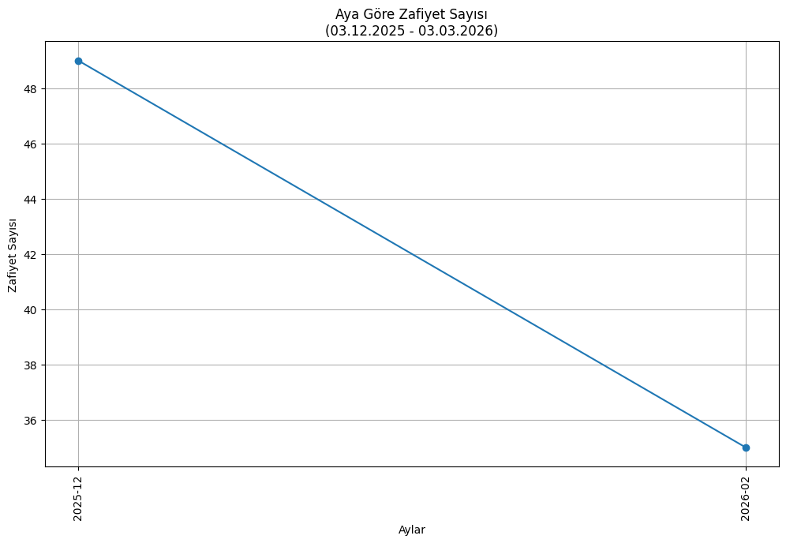
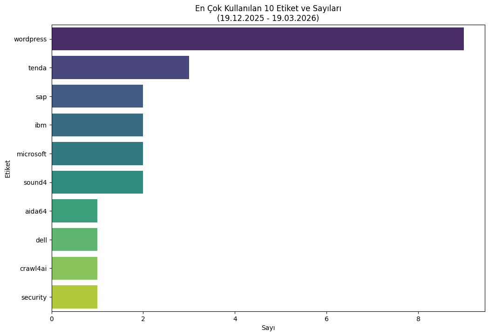
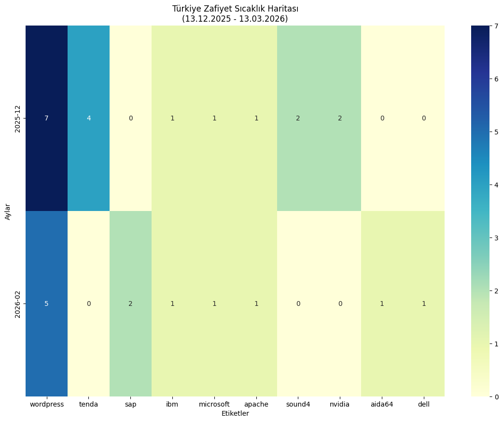

# USOM Zafiyet Panosu

[](https://github.com/emregulerr/usom-zafiyet-panosu/actions/workflows/update_data.yml)
[](https://usom-zafiyet-panosu.streamlit.app/)

Bu proje, Türkiye Ulusal Siber Olaylara Müdahale Merkezi (USOM) tarafından yayınlanan zafiyetleri API aracılığıyla çeker, analiz eder ve bu sayfayı bir gösterge panosu olarak kullanarak görselleştirir. 🚀

## ✨ Otomatik Güncelleme

Bu repo, **GitHub Actions** kullanılarak **her gün otomatik olarak güncellenmektedir**. Bu sayede aşağıdaki görseller ve `output` klasöründeki veriler, son 3 ayın verilerini yansıtacak şekilde her zaman güncel kalır.

## 📊 Görsel Çıktılar

<table>
  <tr>
    <td align="center"><strong>Aylara Göre Zafiyet Sayısı</strong></td>
    <td align="center"><strong>En Popüler 10 Etiket</strong></td>
  </tr>
  <tr>
    <td></td>
    <td></td>
  </tr>
  <tr>
    <td colspan="2" align="center">
      <strong>Aylık Zafiyet Yoğunluğu (Isı Haritası)</strong>
      <br>
      
    </td>
  </tr>
</table>

## ⚙️ Kurulum

1.  Projeyi klonlayın:
    ```bash
    git clone [https://github.com/emregulerr/usom-zafiyet-panosu.git](https://github.com/emregulerr/usom-zafiyet-panosu.git)
    cd usom-zafiyet-panosu
    ```

2.  Gerekli kütüphaneleri yükleyin:
    ```bash
    pip install -r requirements.txt
    ```

## 🚀 Kullanım

Script, oldukça esnek bir tarih aralığı yönetimi sunar. İşte bazı kullanım senaryoları:

---

#### **1. Varsayılan Kullanım (Son 3 Ay)**
Hiçbir parametre vermeden çalıştırdığınızda, son 90 günün verilerini analiz eder.
```bash
python main.py
```

---

#### **2. Süre Belirterek (Örn: Son 30 gün)**
`--days` parametresi ile bugünden geriye doğru istediğiniz gün sayısını belirleyebilirsiniz.
```bash
python main.py --days 30
```

---

#### **3. Belirli Bir Tarihten Bugüne**
`--start-date` ile bir başlangıç tarihi belirleyebilirsiniz. Bitiş tarihi otomatik olarak bugün kabul edilir.
```bash
python main.py --start-date 2025-01-01
```

---

#### **4. Net Tarih Aralığı Belirleme**
Hem başlangıç hem de bitiş tarihini belirterek net bir aralıkta sorgulama yapabilirsiniz.
```bash
python main.py --start-date 2025-01-01 --end-date 2025-03-31
```

---

#### **5. Geçmişteki Bir Aralığı Sorgulama**
`--days` ve `--end-date` parametrelerini birleştirerek geçmişteki belirli bir dönemi analiz edebilirsiniz. Örneğin aşağıdaki komut, 1 Mayıs 2025'ten önceki 60 günlük periyodu (yani 2 Mart 2025 - 1 Mayıs 2025 arasını) analiz eder.
```bash
python main.py --days 60 --end-date 2025-05-01
```
> **Not:** `--days` ve `--start-date` argümanları aynı anda kullanılamaz.

## 🤝 Katkıda Bulunma

Katkılarınız projeyi daha da ileriye taşıyacaktır! Her türlü katkıya açığız. Katkıda bulunmak için lütfen aşağıdaki adımları izleyin:

1.  Bu repoyu **fork'layın**.
2.  Yeni bir **branch** oluşturun (`git checkout -b ozellik/yeni-bir-ozellik`).
3.  Değişikliklerinizi **commit'leyin** (`git commit -m 'Yeni bir özellik eklendi'`).
4.  Branch'inizi **push'layın** (`git push origin ozellik/yeni-bir-ozellik`).
5.  Bir **Pull Request** açın.

Ayrıca, eklemek istediğiniz büyük değişiklikleri tartışmak için bir **issue** açmaktan çekinmeyin.

## 💡 Geliştirme Fikirleri

Projenin potansiyelini artırmak için üzerinde çalışılabilecek bazı fikirler:

- [X] **İnteraktif Arayüz:** [Streamlit](https://streamlit.io/) veya [Dash](https://plotly.com/dash/) kullanarak verilerin incelenebileceği interaktif bir web arayüzü oluşturmak.
- [ ] **Farklı Analizler:** Zafiyet başlıklarından bir kelime bulutu oluşturmak veya belirli CVE kodlarına göre gruplama yapmak.
- [ ] **Veritabanı Entegrasyonu:** Verileri CSV yerine bir SQLite veya PostgreSQL veritabanında saklamak.
- [ ] **Gelişmiş Filtreleme:** Ürün adına veya etikete göre filtreleme yapabilen argümanlar eklemek (`--tag "openssl"` gibi).

## 📜 Lisans

Bu proje, MIT Lisansı koşulları altında lisanslanmıştır. Tam metin için `LICENSE` dosyasına bakınız.
